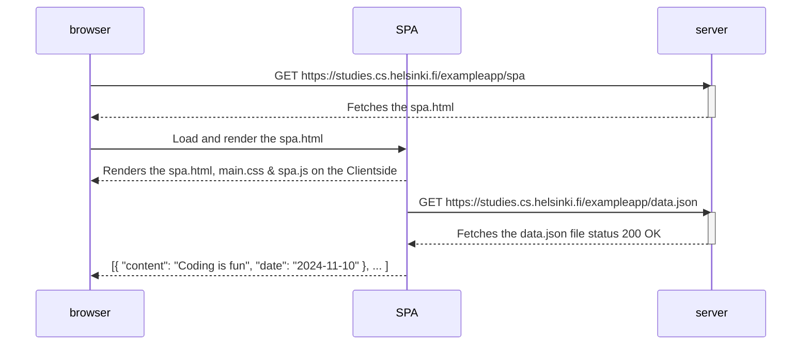

# Sequence Diagram when loading a SPA page
What happens when you load a SPA notes app?

```mermaid
sequenceDiagram
    participant browser
    participant SPA
    participant server

    browser->>server: GET https://studies.cs.helsinki.fi/exampleapp/spa
    activate server
    server-->>browser: Fetches the spa.html
    deactivate server
    browser->>SPA: Load and render the spa.html 
    SPA-->>browser: Renders the spa.html, main.css & spa.js on the Clientside

    SPA->>server: GET https://studies.cs.helsinki.fi/exampleapp/data.json
    activate server
    server-->>SPA: Fetches the data.json file status 200 OK
    deactivate server

    SPA-->>browser: [{ "content": "Coding is fun", "date": "2024-11-10" }, ... ]
```