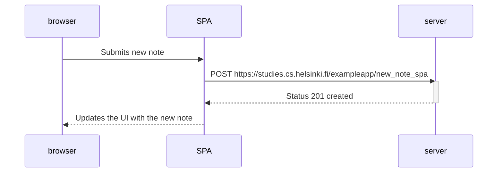

# Sequence Diagram when loading a SPA page
What happens when you create a new note in a SPA notes app?

```mermaid
sequenceDiagram
    participant browser
    participant SPA
    participant server

    browser->>SPA: Submits new note 
    SPA->>server: POST https://studies.cs.helsinki.fi/exampleapp/new_note_spa
    activate server
    server-->>SPA: Status 201 created
    deactivate server

    SPA-->>browser: Updates the UI with the new note

```